<div align="center">


---

System Audio Capture | 12 ASR Providers | Local-First AI Review Workspace

English | [简体中文](./README_ZH.md) | [繁體中文](./README_TW.md) | [日本語](./README_JA.md)

[](https://github.com/XimilalaXiang/DeLive/releases)
[](https://github.com/XimilalaXiang/DeLive/blob/main/LICENSE)
[](https://github.com/XimilalaXiang/DeLive/releases)
[](https://github.com/XimilalaXiang/DeLive/releases)
[](https://github.com/XimilalaXiang/DeLive/releases)
[](https://github.com/XimilalaXiang/DeLive/releases)
[](https://github.com/XimilalaXiang/DeLive)
[](https://deepwiki.com/XimilalaXiang/DeLive)
[](https://docs.delive.me/)

</div>

<div align="center">

🌐 **[Official Website](https://delive.me)** · 📖 **[Documentation](https://docs.delive.me)** · 📋 **[Getting Started](https://docs.delive.me/guide/getting-started)** · ⬇️ **[Download](https://github.com/XimilalaXiang/DeLive/releases/latest)**

</div>

DeLive is a desktop transcription workspace for system audio. It captures whatever your computer is playing, routes the audio through any of twelve ASR backends, keeps everything on your machine, and turns completed transcripts into searchable history with a full AI Review Desk — AI transcript correction, rich Markdown-rendered chat, Q&A threads, structured briefings, and mind maps. It also supports uploading audio/video files for offline transcription, with ten cloud engines available for file transcription.

<div align="center">

#

| Live Transcription | Caption Overlay | MCP Integration |
|:---:|:---:|:---:|
| Real-time transcription with 12 ASR providers | Draggable always-on-top floating caption window | External AI tools access DeLive via MCP protocol |
|  |  |  |

| AI Overview | AI Correction | AI Chat |
|:---:|:---:|:---:|
| Summary, action items, keywords, and chapters | Quick Fix and Review & Fix modes with diff view | Multi-thread conversation with cited references |
|  |  |  |

#

</div>

## 🎯 Core Features

- **System-audio capture** — browser video, live streams, meetings, courses, podcasts, or any other playback source
- **Twelve ASR backends** — Soniox, Volcengine, Groq, SiliconFlow, Mistral AI, Deepgram, AssemblyAI, ElevenLabs, Gladia, Cloudflare Workers AI, OpenAI-compatible local services, and local whisper.cpp
- **File transcription** — upload audio/video files for offline transcription with ten cloud engines
- **AI Review Desk** — transcript correction (Quick Fix / Review & Fix), structured briefings, multi-thread chat, Q&A, and mind maps
- **Floating caption overlay** — always-on-top window with source / translated / dual display modes
- **Soniox bilingual & speaker-aware** — realtime translation, dual-line captions, speaker diarization
- **Topics** — organize sessions into project-like containers
- **Local-first** — sessions, tags, topics, and settings stored locally; optional S3/WebDAV cloud backup
- **Open API & MCP** — local REST API, real-time WebSocket, MCP server for AI agents
- **Cross-platform** — Windows, macOS, and Linux

> 📖 Full feature details in the [documentation](https://docs.delive.me/guide/what-is-delive).

## 📥 Download

<div align="center">

[](https://github.com/XimilalaXiang/DeLive/releases/latest)
[](https://github.com/XimilalaXiang/DeLive/releases/latest)
[](https://github.com/XimilalaXiang/DeLive/releases/latest)

</div>

| Platform | Files |
|----------|-------|
| Windows | `.exe` installer, portable `.exe` |
| macOS | `.dmg`, `.zip` (Intel x64 and Apple Silicon arm64) |
| Linux | `.AppImage`, `.deb` |

## 🔌 Supported ASR Providers

| Provider | Type | Transport | File | Highlights |
|----------|------|-----------|------|------------|
| **Soniox V4** | Cloud | Realtime streaming | Yes | Token-level transcription, realtime translation, bilingual captions, speaker diarization |
| **Volcengine** | Cloud | Realtime streaming | Yes | Chinese-oriented realtime path with embedded proxy |
| **ElevenLabs** | Cloud | Realtime streaming | Yes | Scribe v2 Realtime; 99 languages |
| **Mistral AI** | Cloud | Realtime streaming | Yes | Voxtral Realtime |
| **Gladia** | Cloud | Realtime streaming | Yes | Solaria-1; 100+ languages; <300ms latency |
| **Deepgram** | Cloud | Realtime streaming | Yes | Nova-3 / Nova-2 streaming |
| **AssemblyAI** | Cloud | Realtime streaming | Yes | Universal-3 Pro streaming |
| **Cloudflare Workers AI** | Cloud | Windowed batch | Yes | Whisper-based; low cost with free tier |
| **SiliconFlow** | Cloud | Windowed batch | Yes | SenseVoice, TeleSpeech, Qwen Omni |
| **Groq** | Cloud | Windowed batch | Yes | Whisper large-v3-turbo / large-v3 |
| **Local OpenAI-compatible** | Local | Windowed batch | — | Works with Ollama or compatible gateways |
| **Local whisper.cpp** | Local | Electron-managed | — | Fully local; DeLive manages binary and model lifecycle |

> 📖 Provider setup details: [API Keys Guide](https://docs.delive.me/guide/api-keys) · [Provider Comparison](https://docs.delive.me/guide/providers)

## 🚀 Quick Start

```bash
git clone https://github.com/XimilalaXiang/DeLive.git
cd DeLive
npm run install:all
npm run dev
```

> 📖 Full development guide: [Setup](https://docs.delive.me/development/setup) · [Building](https://docs.delive.me/development/build) · [Testing](https://docs.delive.me/development/testing)

## 🏗 System Architecture

```mermaid
graph TB
    subgraph "Desktop Shell"
        EM[Electron Main Process]
        WIN[Main Window]
        CAP[Caption Overlay Window]
        DESK[Tray / Shortcut / Auto Launch / Updater]
        SEC[IPC Security / SafeStorage / Diagnostics]
    end

    subgraph "Renderer"
        UI[React App]
        STORES[Zustand Stores]
        CFG[Provider and Runtime Setup]
        PREV[History / Preview / AI Workspace]
    end

    subgraph "Orchestration"
        ASR[useASR]
        CAPMGR[CaptureManager]
        PROVSESS[ProviderSessionManager]
        CAPBR[CaptionBridge]
    end

    subgraph "Capture Pipeline"
        GDM[getDisplayMedia]
        MR[MediaRecorder<br/>WebM / Opus]
        AP[AudioWorklet<br/>PCM16 16kHz]
    end

    subgraph "Provider Layer"
        REG[Provider Registry]
        SON[Soniox]
        VOL[Volcengine]
        ELB[ElevenLabs]
        MIS[Mistral AI]
        GLA[Gladia]
        DPG[Deepgram]
        AAI[AssemblyAI]
        CFL[Cloudflare Workers AI]
        SIL[SiliconFlow]
        GRQ[Groq]
        LOA[Local OpenAI-compatible]
        WCP[whisper.cpp Runtime]
    end

    subgraph "Electron Services"
        PROXY[Embedded Multi-Provider Proxy]
        RTM[Local Runtime Controller]
    end

    subgraph "Persistence"
        REPO[Session Repository]
        IDB[IndexedDB]
        LS[localStorage]
        SAFE[safeStorage]
    end

    UI --> STORES
    UI --> CFG
    UI --> PREV
    UI --> ASR

    ASR --> CAPMGR
    ASR --> PROVSESS
    ASR --> CAPBR

    CAPMGR --> GDM
    GDM --> MR
    GDM --> AP

    PROVSESS --> REG
    REG --> SON
    REG --> VOL
    REG --> ELB
    REG --> MIS
    REG --> GLA
    REG --> DPG
    REG --> AAI
    REG --> CFL
    REG --> SIL
    REG --> GRQ
    REG --> LOA
    REG --> WCP

    MR --> SON
    MR --> LOA
    AP --> VOL
    AP --> ELB
    AP --> MIS
    AP --> GLA
    AP --> DPG
    AP --> AAI
    AP --> CFL
    AP --> SIL
    AP --> GRQ
    AP --> WCP

    VOL --> PROXY
    MIS --> PROXY
    DPG --> PROXY
    AAI --> PROXY
    ELB --> PROXY
    GLA --> PROXY
    WCP --> RTM

    STORES --> REPO
    REPO --> IDB
    REPO --> LS
    CFG --> SAFE

    UI --> EM
    EM --> WIN
    EM --> CAP
    EM --> DESK
    EM --> SEC
    EM --> PROXY
    EM --> RTM
    CAPBR --> CAP

    style UI fill:#61dafb,color:#000
    style EM fill:#334155,color:#fff
    style CAP fill:#f472b6,color:#000
    style REG fill:#f59e0b,color:#000
    style PROXY fill:#10b981,color:#fff
    style RTM fill:#0f766e,color:#fff
    style SEC fill:#ef4444,color:#fff
    style SAFE fill:#a855f7,color:#fff
    style IDB fill:#3b82f6,color:#fff
```



> 📖 Detailed architecture: [Overview](https://docs.delive.me/architecture/overview) · [Providers](https://docs.delive.me/architecture/providers) · [Electron IPC](https://docs.delive.me/architecture/electron-ipc) · [Data Flow](https://docs.delive.me/architecture/data) · [Security](https://docs.delive.me/architecture/security)

## 📁 Project Structure

```text
DeLive/
├── electron/          # Electron main process, windows, tray, IPC, updater, runtime, Open API server
├── frontend/          # React renderer app, providers, stores, UI components, tests
├── shared/            # Shared TypeScript contracts and provider proxy helpers
├── server/            # Standalone proxy server for debugging
├── mcp/               # MCP server for AI agents (Claude, Cursor, etc.)
├── skills/            # Agent skill definitions
├── scripts/           # Icon generation, runtime staging, release notes
├── docs/              # VitePress documentation site source
├── landing/           # Landing page source
└── package.json
```

> 📖 Full project map: [Project Structure](https://docs.delive.me/development/structure)

## 🔧 Tech Stack

| Layer | Technology |
|-------|------------|
| Desktop app | Electron 40 |
| Frontend | React 18.3 + TypeScript 5.6 + Vite 6 |
| Styling | Tailwind CSS 3.4 |
| State management | Zustand 4.5 |
| Testing | Vitest 4 (314 tests / 32 files) |
| Persistence | IndexedDB, localStorage, Electron safeStorage |
| Packaging | electron-builder + GitHub Actions |

## 🌐 Open API & MCP

DeLive exposes a local REST API, real-time WebSocket, and an MCP server for AI agents — all disabled by default, with optional Bearer token authentication.

> 📖 Full API reference: [REST](https://docs.delive.me/api/rest) · [WebSocket](https://docs.delive.me/api/websocket) · [MCP Server](https://docs.delive.me/api/mcp) · [Authentication](https://docs.delive.me/api/authentication) · [Agent Skill](https://docs.delive.me/api/agent-skill)

## ⚠️ Notes

- **System requirements**: Windows 10+, macOS 13+, or Linux with PulseAudio loopback support.
- **Provider proxies** are embedded in Electron — no separate backend needed for desktop usage.
- **Tray behavior**: closing the main window hides to tray instead of exiting.
- **Auto-update**: supported on Windows, macOS, and Linux AppImage.

### 🛡️ Windows SmartScreen Warning

Windows may show a SmartScreen warning on first launch. Click **More info** → **Run anyway**.

## 📄 License

Apache License 2.0

## 🙏 Acknowledgments

- [BiBi-Keyboard](https://github.com/BryceWG/BiBi-Keyboard) for multi-provider architecture inspiration
- [ByteDance](https://www.bytedance.com) — Volcengine speech recognition service and Lark AI Campus Challenge support
- [LINUX.DO](https://linux.do) community — a place where we learned a great deal and received generous support

---

<div align="center">

[](https://www.star-history.com/#XimilalaXiang/DeLive&type=date&legend=top-left)

**Made by [XimilalaXiang](https://github.com/XimilalaXiang)**

</div>
