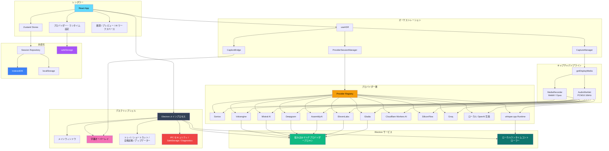

<div align="center">


---

システム音声キャプチャ | マルチプロバイダー ASR | ローカルファーストの AI レビューワークスペース

[English](./README.md) | [简体中文](./README_ZH.md) | [繁體中文](./README_TW.md) | 日本語

[](https://github.com/XimilalaXiang/DeLive/releases)
[](https://github.com/XimilalaXiang/DeLive/blob/main/LICENSE)
[](https://github.com/XimilalaXiang/DeLive/releases)
[](https://github.com/XimilalaXiang/DeLive/releases)
[](https://github.com/XimilalaXiang/DeLive/releases)
[](https://github.com/XimilalaXiang/DeLive/releases)
[](https://github.com/XimilalaXiang/DeLive)
[](https://docs.delive.me/)

</div>

<div align="center">

🌐 **[公式サイト](https://delive.me)** · 📖 **[ドキュメント](https://docs.delive.me/)** · 📋 **[使い方ガイド](https://docs.delive.me/guide/getting-started)** · ⬇️ **[ダウンロード](https://github.com/XimilalaXiang/DeLive/releases/latest)**

</div>

DeLive はシステム音声向けのデスクトップ文字起こしワークスペースです。PC が再生している音声をキャプチャし、12 種の ASR バックエンドから最適なパイプラインで送り、セッションをローカルに保存します。録音完了後は、AI 校正、リッチ Markdown チャット、構造化ブリーフィング、セッション Q&A、マインドマップ機能を備えた AI レビューデスクで振り返りが可能です。また、音声/動画ファイルをアップロードしてオフライン文字起こしも可能で、10 種のクラウドエンジンがファイル文字起こしに対応しています。

<div align="center">

#

| リアルタイム文字起こし | 字幕オーバーレイ | MCP 統合 |
|:---:|:---:|:---:|
| マルチプロバイダー ASR リアルタイム文字起こし | ドラッグ可能な常時最前面字幕ウィンドウ | 外部 AI ツールが MCP プロトコルで DeLive にアクセス |
|  |  |  |

| AI 概要 | AI 校正 | AI チャット |
|:---:|:---:|:---:|
| 要約、アクションアイテム、キーワード、チャプター | クイックフィックス & レビュー後修正、差分ビュー | マルチスレッド会話、引用付き |
|  |  |  |

#

</div>

## 🎯 主な機能

- **システム音声キャプチャ** — ブラウザ動画、ライブ配信、会議、講義、ポッドキャスト等、再生中の音声を取り込み
- **12 種の ASR バックエンド** — Soniox、Volcengine、Groq、SiliconFlow、Mistral AI、Deepgram、AssemblyAI、ElevenLabs、Gladia、Cloudflare Workers AI、ローカル OpenAI 互換、ローカル whisper.cpp
- **ファイル文字起こし** — 音声/動画ファイルをアップロードし、10 種のクラウドエンジンでオフライン文字起こし
- **AI レビューデスク** — 文字起こし校正（クイックフィックス / レビュー後修正）、構造化ブリーフィング、マルチスレッドチャット、Q&A、マインドマップ
- **字幕オーバーレイ** — 常時最前面ウィンドウ、原文 / 翻訳 / バイリンガルモード対応
- **Soniox バイリンガル & 話者認識** — リアルタイム翻訳、二言語字幕、話者分離
- **トピック** — セッションをプロジェクト風のコンテナに整理
- **ローカルファースト** — セッション、タグ、トピック、設定はローカル保存；S3/WebDAV クラウドバックアップはオプション
- **Open API & MCP** — ローカル REST API、リアルタイム WebSocket、AI エージェント用 MCP サーバー
- **クロスプラットフォーム** — Windows、macOS、Linux

> 📖 機能の詳細：[ドキュメント](https://docs.delive.me/guide/what-is-delive)

## 📥 ダウンロード

<div align="center">

[](https://github.com/XimilalaXiang/DeLive/releases/latest)
[](https://github.com/XimilalaXiang/DeLive/releases/latest)
[](https://github.com/XimilalaXiang/DeLive/releases/latest)

</div>

| プラットフォーム | ファイル |
|------------------|----------|
| Windows | `.exe` インストーラー、ポータブル `.exe` |
| macOS | `.dmg`、`.zip`（Intel x64 / Apple Silicon arm64） |
| Linux | `.AppImage`、`.deb` |

## 🔌 対応 ASR プロバイダー

| プロバイダー | タイプ | 転送方式 | ファイル | ハイライト |
|-------------|--------|----------|----------|-----------|
| **Soniox V4** | クラウド | リアルタイムストリーミング | 対応 | トークンレベルの文字起こし、リアルタイム翻訳、二言語字幕、話者分離 |
| **Volcengine** | クラウド | リアルタイムストリーミング | 対応 | 中国語特化、組み込みプロキシ |
| **ElevenLabs** | クラウド | リアルタイムストリーミング | 対応 | Scribe v2 Realtime、99 言語 |
| **Mistral AI** | クラウド | リアルタイムストリーミング | 対応 | Voxtral Realtime |
| **Gladia** | クラウド | リアルタイムストリーミング | 対応 | Solaria-1、100+ 言語、<300ms 遅延 |
| **Deepgram** | クラウド | リアルタイムストリーミング | 対応 | Nova-3 / Nova-2 ストリーミング |
| **AssemblyAI** | クラウド | リアルタイムストリーミング | 対応 | Universal-3 Pro ストリーミング |
| **Cloudflare Workers AI** | クラウド | ウィンドウバッチ | 対応 | Whisper ベース、低コスト・無料枠あり |
| **SiliconFlow** | クラウド | ウィンドウバッチ | 対応 | SenseVoice、TeleSpeech、Qwen Omni |
| **Groq** | クラウド | ウィンドウバッチ | 対応 | Whisper large-v3-turbo / large-v3 |
| **ローカル OpenAI 互換** | ローカル | ウィンドウバッチ | — | Ollama や互換ゲートウェイに対応 |
| **ローカル whisper.cpp** | ローカル | Electron 管理 | — | 完全ローカル動作、DeLive がバイナリとモデルを管理 |

> 📖 プロバイダー設定：[API Key ガイド](https://docs.delive.me/guide/api-keys) · [プロバイダー比較](https://docs.delive.me/guide/providers)

## 🚀 クイックスタート

```bash
git clone https://github.com/XimilalaXiang/DeLive.git
cd DeLive
npm run install:all
npm run dev
```

> 📖 開発ガイド：[セットアップ](https://docs.delive.me/development/setup) · [ビルド](https://docs.delive.me/development/build) · [テスト](https://docs.delive.me/development/testing)

## 🏗️ システムアーキテクチャ



> 📖 アーキテクチャ詳細：[概要](https://docs.delive.me/architecture/overview) · [プロバイダー](https://docs.delive.me/architecture/providers) · [Electron IPC](https://docs.delive.me/architecture/electron-ipc) · [データフロー](https://docs.delive.me/architecture/data) · [セキュリティ](https://docs.delive.me/architecture/security)

## 📁 プロジェクト構成

```text
DeLive/
├── electron/          # Electron メインプロセス、ウィンドウ、トレイ、IPC、アップデーター、ランタイム、Open API サーバー
├── frontend/          # React レンダラー、プロバイダー、Store、UI コンポーネント、テスト
├── shared/            # 共有 TypeScript 契約とプロキシヘルパー
├── server/            # デバッグ用スタンドアロンプロキシサーバー
├── mcp/               # AI エージェント用 MCP サーバー（Claude、Cursor 等）
├── skills/            # エージェントスキル定義
├── scripts/           # アイコン生成、ランタイムステージング、リリースノート
├── docs/              # VitePress ドキュメントサイトソース
├── landing/           # ランディングページソース
└── package.json
```

> 📖 プロジェクト構成の詳細：[プロジェクト構成](https://docs.delive.me/development/structure)

## 🔧 技術スタック

| レイヤー | 技術 |
|----------|------|
| デスクトップアプリ | Electron 40 |
| フロントエンド | React 18.3 + TypeScript 5.6 + Vite 6 |
| スタイリング | Tailwind CSS 3.4 |
| 状態管理 | Zustand 4.5 |
| テスト | Vitest 4（314 テスト / 32 ファイル） |
| 永続化 | IndexedDB、localStorage、Electron safeStorage |
| パッケージング | electron-builder + GitHub Actions |

## 🌐 Open API & MCP

DeLive はローカル REST API、リアルタイム WebSocket、MCP サーバーで文字起こしデータを公開します——デフォルトは無効、Bearer Token 認証はオプション。

> 📖 API リファレンス：[REST](https://docs.delive.me/api/rest) · [WebSocket](https://docs.delive.me/api/websocket) · [MCP サーバー](https://docs.delive.me/api/mcp) · [認証](https://docs.delive.me/api/authentication) · [Agent Skill](https://docs.delive.me/api/agent-skill)

## ⚠️ 注意事項

- **システム要件**：Windows 10+、macOS 13+、または PulseAudio loopback 対応の Linux。
- **プロバイダープロキシ**は Electron に組み込まれており、通常のデスクトップ使用では別途バックエンドは不要。
- **トレイ動作**：メインウィンドウを閉じるとトレイに隠れます。
- **自動更新**：Windows、macOS、Linux AppImage に対応。

### 🛡️ Windows SmartScreen の警告

初回起動時に SmartScreen の警告が表示される場合があります。**詳細情報** → **実行** をクリックしてください。

## 📄 ライセンス

Apache License 2.0

## 🙏 謝辞

- [BiBi-Keyboard](https://github.com/BryceWG/BiBi-Keyboard) — マルチプロバイダーアーキテクチャのインスピレーション
- [ByteDance](https://www.bytedance.com) — Volcengine 音声認識サービスと Lark AI キャンパスチャレンジのサポート
- [LINUX.DO](https://linux.do) コミュニティ — 多くのことを学び、惜しみないサポートをいただきました

---

<div align="center">

[](https://www.star-history.com/#XimilalaXiang/DeLive&type=date&legend=top-left)

**Made by [XimilalaXiang](https://github.com/XimilalaXiang)**

</div>
