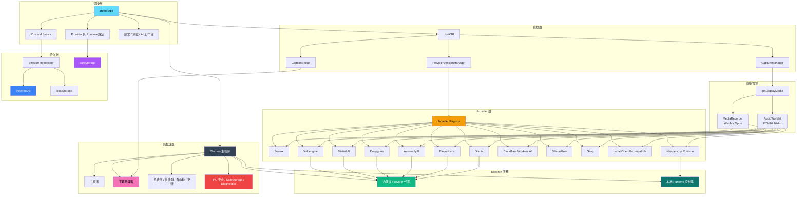

<div align="center">


---

系統音訊擷取 | 多 Provider ASR | 本地優先的 AI 複盤工作台

[English](./README.md) | [简体中文](./README_ZH.md) | 繁體中文 | [日本語](./README_JA.md)

[](https://github.com/XimilalaXiang/DeLive/releases)
[](https://github.com/XimilalaXiang/DeLive/blob/main/LICENSE)
[](https://github.com/XimilalaXiang/DeLive/releases)
[](https://github.com/XimilalaXiang/DeLive/releases)
[](https://github.com/XimilalaXiang/DeLive/releases)
[](https://github.com/XimilalaXiang/DeLive/releases)
[](https://github.com/XimilalaXiang/DeLive)
[](https://docs.delive.me/zh/)

</div>

<div align="center">

🌐 **[官方網站](https://delive.me)** · 📖 **[專案文檔](https://docs.delive.me/zh/)** · 📋 **[使用指南](https://docs.delive.me/zh/guide/getting-started)** · ⬇️ **[立即下載](https://github.com/XimilalaXiang/DeLive/releases/latest)**

</div>

DeLive 是一個面向系統音訊的桌面轉錄工作台。它會擷取電腦正在播放的聲音，按所選 Provider 的能力選擇最合適的轉錄鏈路（共支援 12 種 ASR 後端），把會話保存在本機，並在錄製結束後提供完整的 AI 複盤工作台——支援 AI 糾錯、富文本 Markdown 對話、結構化 briefing、會話問答和思維導圖整理。同時支援上傳音訊/影片檔案進行離線轉錄，10 種雲端引擎均可用於檔案轉錄。

<div align="center">

#

| 即時轉錄 | 字幕懸浮窗 | MCP 整合 |
|:---:|:---:|:---:|
| 12 種 ASR 引擎即時轉錄 | 可拖曳的置頂字幕懸浮窗 | 外部 AI 工具透過 MCP 協定存取 DeLive |
|  |  |  |

| AI 概覽 | AI 糾錯 | AI 對話 |
|:---:|:---:|:---:|
| 摘要、行動項、關鍵詞與章節 | 直接糾錯 & 先檢測後糾錯，並排對比 | 多執行緒對話，帶引用片段 |
|  |  |  |

#

</div>

## 🎯 核心功能

- **系統音訊擷取** — 網頁影片、直播、會議、課程、Podcast，只要共享系統音訊即可接入
- **12 種 ASR 後端** — Soniox、火山引擎、Groq、矽基流動、Mistral AI、Deepgram、AssemblyAI、ElevenLabs、Gladia、Cloudflare Workers AI、本地 OpenAI-compatible、本地 whisper.cpp
- **檔案轉錄** — 上傳音訊/影片檔案，使用 10 種雲端引擎離線轉錄
- **AI 複盤工作台** — 糾錯（直接糾錯 / 先檢測後糾錯）、結構化 briefing、多執行緒對話、問答、思維導圖
- **懸浮字幕窗** — 始終置頂視窗，支援原文 / 翻譯 / 雙語模式
- **Soniox 雙語與發言人辨識** — 即時翻譯、雙語字幕、speaker diarization
- **主題功能** — 將會話歸類到專案容器中
- **本地優先** — 會話、標籤、主題、設定保存在本機；可選 S3/WebDAV 雲端備份
- **開放 API 與 MCP** — 本地 REST API、即時 WebSocket、MCP 伺服器，供 AI Agent 使用
- **跨平台** — Windows、macOS、Linux

> 📖 完整功能介紹：[文檔](https://docs.delive.me/zh/guide/what-is-delive)

## 📥 下載安裝

<div align="center">

[](https://github.com/XimilalaXiang/DeLive/releases/latest)
[](https://github.com/XimilalaXiang/DeLive/releases/latest)
[](https://github.com/XimilalaXiang/DeLive/releases/latest)

</div>

| 平台 | 檔案 |
|------|------|
| Windows | `.exe` 安裝程式、免安裝版 `.exe` |
| macOS | `.dmg`、`.zip`（Intel x64 和 Apple Silicon arm64） |
| Linux | `.AppImage`、`.deb` |

## 🔌 支援的 ASR Provider

| Provider | 類型 | 傳輸模式 | 檔案轉錄 | 亮點 |
|----------|------|----------|----------|------|
| **Soniox V4** | 雲端 | 即時串流 | 支援 | token 級即時轉錄、即時翻譯、雙語字幕、多發言人辨識 |
| **火山引擎** | 雲端 | 即時串流 | 支援 | 中文場景友善，內建代理 |
| **ElevenLabs** | 雲端 | 即時串流 | 支援 | Scribe v2 Realtime，99 種語言 |
| **Mistral AI** | 雲端 | 即時串流 | 支援 | Voxtral Realtime |
| **Gladia** | 雲端 | 即時串流 | 支援 | Solaria-1，100+ 種語言，<300ms 延遲 |
| **Deepgram** | 雲端 | 即時串流 | 支援 | Nova-3 / Nova-2 串流 |
| **AssemblyAI** | 雲端 | 即時串流 | 支援 | Universal-3 Pro 串流 |
| **Cloudflare Workers AI** | 雲端 | 視窗批次 | 支援 | 基於 Whisper，低成本含免費額度 |
| **矽基流動** | 雲端 | 視窗批次 | 支援 | SenseVoice、TeleSpeech、Qwen Omni |
| **Groq** | 雲端 | 視窗批次 | 支援 | Whisper large-v3-turbo / large-v3 |
| **本地 OpenAI-compatible** | 本地 | 視窗批次 | — | 適配 Ollama 或相容閘道 |
| **本地 whisper.cpp** | 本地 | Electron 管理 | — | 全本地運行，DeLive 管理 binary 和模型 |

> 📖 Provider 設定詳情：[API Key 指南](https://docs.delive.me/zh/guide/api-keys) · [Provider 對比](https://docs.delive.me/zh/guide/providers)

## 🚀 快速開始

```bash
git clone https://github.com/XimilalaXiang/DeLive.git
cd DeLive
npm run install:all
npm run dev
```

> 📖 完整開發指南：[環境搭建](https://docs.delive.me/zh/development/setup) · [建置打包](https://docs.delive.me/zh/development/build) · [測試](https://docs.delive.me/zh/development/testing)

## 🏗️ 系統架構



> 📖 詳細架構：[架構總覽](https://docs.delive.me/zh/architecture/overview) · [Provider 架構](https://docs.delive.me/zh/architecture/providers) · [Electron IPC](https://docs.delive.me/zh/architecture/electron-ipc) · [資料流](https://docs.delive.me/zh/architecture/data) · [安全](https://docs.delive.me/zh/architecture/security)

## 📁 專案結構

```text
DeLive/
├── electron/          # Electron 主程序、視窗、系統匣、IPC、更新、runtime、Open API 伺服器
├── frontend/          # React 渲染層、Provider、Store、UI 元件、測試
├── shared/            # 共用 TypeScript 契約與代理 helper
├── server/            # 主要用於除錯的獨立代理伺服器
├── mcp/               # MCP 伺服器，供 AI Agent 使用（Claude、Cursor 等）
├── skills/            # Agent Skill 定義
├── scripts/           # 圖示生成、runtime 預置、release notes
├── docs/              # VitePress 文檔站原始碼
├── landing/           # Landing page 原始碼
└── package.json
```

> 📖 完整專案結構：[專案結構](https://docs.delive.me/zh/development/structure)

## 🔧 技術棧

| 層級 | 技術 |
|------|------|
| 桌面應用 | Electron 40 |
| 前端 | React 18.3 + TypeScript 5.6 + Vite 6 |
| 樣式 | Tailwind CSS 3.4 |
| 狀態管理 | Zustand 4.5 |
| 測試 | Vitest 4（314 測試 / 32 檔案） |
| 持久化 | IndexedDB、localStorage、Electron safeStorage |
| 打包 | electron-builder + GitHub Actions |

## 🌐 開放 API 與 MCP

DeLive 透過本地 REST API、即時 WebSocket 和 MCP 伺服器對外開放轉錄資料——預設關閉，可選 Bearer Token 驗證。

> 📖 完整 API 參考：[REST](https://docs.delive.me/zh/api/rest) · [WebSocket](https://docs.delive.me/zh/api/websocket) · [MCP 伺服器](https://docs.delive.me/zh/api/mcp) · [驗證](https://docs.delive.me/zh/api/authentication) · [Agent Skill](https://docs.delive.me/zh/api/agent-skill)

## ⚠️ 注意事項

- **系統需求**：Windows 10+、macOS 13+、或具備 PulseAudio loopback 的 Linux。
- **Provider 代理**內建在 Electron 中，正常桌面使用無需單獨後端。
- **系統匣行為**：關閉主視窗預設隱藏到系統匣。
- **自動更新**：支援 Windows、macOS 和 Linux AppImage。

### 🛡️ Windows SmartScreen 提示

首次執行時 Windows 可能彈出 SmartScreen 警告。點選 **更多資訊** → **仍要執行**。

## 📄 授權

Apache License 2.0

## 🙏 致謝

- [BiBi-Keyboard](https://github.com/BryceWG/BiBi-Keyboard) — 多 Provider 架構靈感
- [字節跳動](https://www.bytedance.com) — 火山引擎語音辨識服務與飛書 AI 校園挑戰賽支持
- [LINUX.DO](https://linux.do) 社群 — 在這裡學到了很多，感謝社群一直以來的慷慨幫助與支持

---

<div align="center">

[](https://www.star-history.com/#XimilalaXiang/DeLive&type=date&legend=top-left)

**Made by [XimilalaXiang](https://github.com/XimilalaXiang)**

</div>
