<div align="center">


---

系统音频捕获 | 多 Provider ASR | 本地优先的 AI 复盘工作台

[English](./README.md) | 简体中文 | [繁體中文](./README_TW.md) | [日本語](./README_JA.md)

[](https://github.com/XimilalaXiang/DeLive/releases)
[](https://github.com/XimilalaXiang/DeLive/blob/main/LICENSE)
[](https://github.com/XimilalaXiang/DeLive/releases)
[](https://github.com/XimilalaXiang/DeLive/releases)
[](https://github.com/XimilalaXiang/DeLive/releases)
[](https://github.com/XimilalaXiang/DeLive/releases)
[](https://github.com/XimilalaXiang/DeLive)
[](https://docs.delive.me/zh/)

</div>

<div align="center">

🌐 **[官方网站](https://delive.me)** · 📖 **[项目文档](https://docs.delive.me/zh/)** · 📋 **[使用指南](https://docs.delive.me/zh/guide/getting-started)** · ⬇️ **[立即下载](https://github.com/XimilalaXiang/DeLive/releases/latest)**

</div>

DeLive 是一个面向系统音频的桌面转录工作台。它会把电脑正在播放的声音捕获下来，按所选 Provider 的能力选择最合适的转录链路（共支持 12 种 ASR 后端），把会话保存在本地，并在录制结束后提供完整的 AI 复盘工作台——支持 AI 纠错、富文本 Markdown 对话、结构化 briefing、会话问答和思维导图整理。同时支持上传音频/视频文件进行离线转录，10 种云端引擎均可用于文件转录。

<div align="center">

#

| 实时转录 | 字幕悬浮窗 | MCP 集成 |
|:---:|:---:|:---:|
| 12 种 ASR 引擎实时转录 | 可拖拽的置顶字幕悬浮窗 | 外部 AI 工具通过 MCP 协议访问 DeLive |
|  |  |  |

| AI 概览 | AI 纠错 | AI 对话 |
|:---:|:---:|:---:|
| 摘要、行动项、关键词与章节 | 直接纠错 & 先检测后纠错，并排对比 | 多线程对话，带引用片段 |
|  |  |  |

#

</div>

## 🎯 核心功能

- **系统音频采集** — 网页视频、直播、会议、课程、播客，只要共享系统音频即可接入
- **12 种 ASR 后端** — Soniox、火山引擎、Groq、硅基流动、Mistral AI、Deepgram、AssemblyAI、ElevenLabs、Gladia、Cloudflare Workers AI、本地 OpenAI-compatible、本地 whisper.cpp
- **文件转录** — 上传音频/视频文件，使用 10 种云端引擎离线转录
- **AI 复盘工作台** — 纠错（直接纠错 / 先检测后纠错）、结构化 briefing、多线程对话、问答、思维导图
- **悬浮字幕窗** — 始终置顶窗口，支持原文 / 翻译 / 双语模式
- **Soniox 双语与发言人识别** — 实时翻译、双语字幕、speaker diarization
- **主题功能** — 将会话归类到项目容器中
- **本地优先** — 会话、标签、主题、设置保存在本地；可选 S3/WebDAV 云备份
- **开放 API 与 MCP** — 本地 REST API、实时 WebSocket、MCP 服务器，供 AI Agent 使用
- **跨平台** — Windows、macOS、Linux

> 📖 完整功能介绍：[文档](https://docs.delive.me/zh/guide/what-is-delive)

## 📥 下载安装

<div align="center">

[](https://github.com/XimilalaXiang/DeLive/releases/latest)
[](https://github.com/XimilalaXiang/DeLive/releases/latest)
[](https://github.com/XimilalaXiang/DeLive/releases/latest)

</div>

| 平台 | 文件 |
|------|------|
| Windows | `.exe` 安装包、便携版 `.exe` |
| macOS | `.dmg`、`.zip`（Intel x64 和 Apple Silicon arm64） |
| Linux | `.AppImage`、`.deb` |

## 🔌 支持的 ASR Provider

| Provider | 类型 | 传输模式 | 文件转录 | 亮点 |
|----------|------|----------|----------|------|
| **Soniox V5** | 云端 | 实时流式 | 支持 | token 级实时转录、实时翻译、双语字幕、多发言人识别 |
| **火山引擎** | 云端 | 实时流式 | 支持 | 中文场景友好，内置代理 |
| **ElevenLabs** | 云端 | 实时流式 | 支持 | Scribe v2 Realtime，99 种语言 |
| **Mistral AI** | 云端 | 实时流式 | 支持 | Voxtral Realtime |
| **Gladia** | 云端 | 实时流式 | 支持 | Solaria-1，100+ 种语言，<300ms 延迟 |
| **Deepgram** | 云端 | 实时流式 | 支持 | Nova-3 / Nova-2 流式 |
| **AssemblyAI** | 云端 | 实时流式 | 支持 | Universal-3 Pro 流式 |
| **Cloudflare Workers AI** | 云端 | 窗口批处理 | 支持 | 基于 Whisper，低成本含免费额度 |
| **硅基流动** | 云端 | 窗口批处理 | 支持 | SenseVoice、TeleSpeech、Qwen Omni |
| **Groq** | 云端 | 窗口批处理 | 支持 | Whisper large-v3-turbo / large-v3 |
| **本地 OpenAI-compatible** | 本地 | 窗口批处理 | — | 适配 Ollama 或兼容网关 |
| **本地 whisper.cpp** | 本地 | Electron 管理 | — | 全本地运行，DeLive 管理 binary 和模型 |

> 📖 Provider 配置详情：[API Key 指南](https://docs.delive.me/zh/guide/api-keys) · [Provider 对比](https://docs.delive.me/zh/guide/providers)

## 🚀 快速开始

```bash
git clone https://github.com/XimilalaXiang/DeLive.git
cd DeLive
npm run install:all
npm run dev
```

> 📖 完整开发指南：[环境搭建](https://docs.delive.me/zh/development/setup) · [构建打包](https://docs.delive.me/zh/development/build) · [测试](https://docs.delive.me/zh/development/testing)

## 🏗️ 系统架构

```mermaid
graph TB
    subgraph "桌面壳层"
        EM[Electron 主进程]
        WIN[主窗口]
        CAP[字幕悬浮窗]
        DESK[托盘 / 快捷键 / 自启动 / 更新]
        SEC[IPC 安全 / SafeStorage / Diagnostics]
    end

    subgraph "渲染层"
        UI[React App]
        STORES[Zustand Stores]
        CFG[Provider 与 Runtime 设置]
        PREV[历史 / 预览 / AI 工作台]
    end

    subgraph "编排层"
        ASR[useASR]
        CAPMGR[CaptureManager]
        PROVSESS[ProviderSessionManager]
        CAPBR[CaptionBridge]
    end

    subgraph "采集管线"
        GDM[getDisplayMedia]
        MR[MediaRecorder<br/>WebM / Opus]
        AP[AudioWorklet<br/>PCM16 16kHz]
    end

    subgraph "Provider 层"
        REG[Provider Registry]
        SON[Soniox]
        VOL[Volcengine]
        ELB[ElevenLabs]
        MIS[Mistral AI]
        GLA[Gladia]
        DPG[Deepgram]
        AAI[AssemblyAI]
        CFL[Cloudflare Workers AI]
        SIL[SiliconFlow]
        GRQ[Groq]
        LOA[Local OpenAI-compatible]
        WCP[whisper.cpp Runtime]
    end

    subgraph "Electron 服务"
        PROXY[内置多 Provider 代理]
        RTM[本地 Runtime 控制器]
    end

    subgraph "持久化"
        REPO[Session Repository]
        IDB[IndexedDB]
        LS[localStorage]
        SAFE[safeStorage]
    end

    UI --> STORES
    UI --> CFG
    UI --> PREV
    UI --> ASR

    ASR --> CAPMGR
    ASR --> PROVSESS
    ASR --> CAPBR

    CAPMGR --> GDM
    GDM --> MR
    GDM --> AP

    PROVSESS --> REG
    REG --> SON
    REG --> VOL
    REG --> ELB
    REG --> MIS
    REG --> GLA
    REG --> DPG
    REG --> AAI
    REG --> CFL
    REG --> SIL
    REG --> GRQ
    REG --> LOA
    REG --> WCP

    MR --> SON
    MR --> LOA
    AP --> VOL
    AP --> ELB
    AP --> MIS
    AP --> GLA
    AP --> DPG
    AP --> AAI
    AP --> CFL
    AP --> SIL
    AP --> GRQ
    AP --> WCP

    VOL --> PROXY
    MIS --> PROXY
    DPG --> PROXY
    AAI --> PROXY
    ELB --> PROXY
    GLA --> PROXY
    WCP --> RTM

    STORES --> REPO
    REPO --> IDB
    REPO --> LS
    CFG --> SAFE

    UI --> EM
    EM --> WIN
    EM --> CAP
    EM --> DESK
    EM --> SEC
    EM --> PROXY
    EM --> RTM
    CAPBR --> CAP

    style UI fill:#61dafb,color:#000
    style EM fill:#334155,color:#fff
    style CAP fill:#f472b6,color:#000
    style REG fill:#f59e0b,color:#000
    style PROXY fill:#10b981,color:#fff
    style RTM fill:#0f766e,color:#fff
    style SEC fill:#ef4444,color:#fff
    style SAFE fill:#a855f7,color:#fff
    style IDB fill:#3b82f6,color:#fff
```



> 📖 详细架构：[架构总览](https://docs.delive.me/zh/architecture/overview) · [Provider 架构](https://docs.delive.me/zh/architecture/providers) · [Electron IPC](https://docs.delive.me/zh/architecture/electron-ipc) · [数据流](https://docs.delive.me/zh/architecture/data) · [安全](https://docs.delive.me/zh/architecture/security)

## 📁 项目结构

```text
DeLive/
├── electron/          # Electron 主进程、窗口、托盘、IPC、更新、runtime、Open API 服务器
├── frontend/          # React 渲染层、Provider、Store、UI 组件、测试
├── shared/            # 共用 TypeScript 契约与代理 helper
├── server/            # 主要用于调试的独立代理服务器
├── mcp/               # MCP 服务器，供 AI Agent 使用（Claude、Cursor 等）
├── skills/            # Agent Skill 定义
├── scripts/           # 图标生成、runtime 预置、release notes
├── docs/              # VitePress 文档站源码
├── landing/           # Landing page 源码
└── package.json
```

> 📖 完整项目结构：[项目结构](https://docs.delive.me/zh/development/structure)

## 🔧 技术栈

| 层级 | 技术 |
|------|------|
| 桌面应用 | Electron 40 |
| 前端 | React 18.3 + TypeScript 5.6 + Vite 6 |
| 样式 | Tailwind CSS 3.4 |
| 状态管理 | Zustand 4.5 |
| 测试 | Vitest 4（314 测试 / 32 文件） |
| 持久化 | IndexedDB、localStorage、Electron safeStorage |
| 打包 | electron-builder + GitHub Actions |

## 🌐 开放 API 与 MCP

DeLive 通过本地 REST API、实时 WebSocket 和 MCP 服务器对外开放转录数据——默认关闭，可选 Bearer Token 鉴权。

> 📖 完整 API 参考：[REST](https://docs.delive.me/zh/api/rest) · [WebSocket](https://docs.delive.me/zh/api/websocket) · [MCP 服务器](https://docs.delive.me/zh/api/mcp) · [鉴权](https://docs.delive.me/zh/api/authentication) · [Agent Skill](https://docs.delive.me/zh/api/agent-skill)

## ⚠️ 注意事项

- **系统要求**：Windows 10+、macOS 13+、或具备 PulseAudio loopback 的 Linux。
- **Provider 代理**内置在 Electron 中，正常桌面使用无需单独后端。
- **托盘行为**：关闭主窗口默认隐藏到托盘。
- **自动更新**：支持 Windows、macOS 和 Linux AppImage。

### 🛡️ Windows SmartScreen 提示

首次运行时 Windows 可能弹出 SmartScreen 警告。点击 **更多信息** → **仍要运行**。

## 📄 许可证

Apache License 2.0

## 🙏 致谢

- [BiBi-Keyboard](https://github.com/BryceWG/BiBi-Keyboard) — 多 Provider 架构灵感
- [字节跳动](https://www.bytedance.com) — 火山引擎语音识别服务与飞书 AI 校园挑战赛支持
- [LINUX.DO](https://linux.do) 社区 — 在这里学到了很多，感谢社区一直以来的慷慨帮助与支持

---

<div align="center">

[](https://www.star-history.com/#XimilalaXiang/DeLive&type=date&legend=top-left)

**Made by [XimilalaXiang](https://github.com/XimilalaXiang)**

</div>
